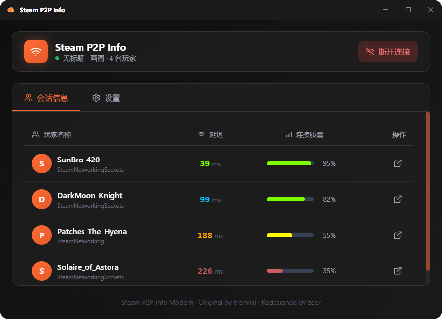

<p align="center">
  
</p>

<h1 align="center">SteamP2PInfo</h1>

<p align="center">
  基于 <a href="https://github.com/tremwil/SteamP2PInfo">tremwil/SteamP2PInfo</a> 重构，使用现代化技术栈重写了界面
</p>

<p align="center">
  
</p>

## 🛠️ 技术栈

- **后端**: .NET 8 + WPF + WebView2
- **前端**: React 18 + TypeScript + Tailwind CSS

## 📋 系统要求

- Windows 10 1903+ 或 Windows 11
- Steam 客户端

## 🚀 快速开始

### 使用预编译版本

1. 从 Releases 下载 `SteamP2PInfo.exe`
2. 右键以管理员身份运行
3. 点击"连接游戏"选择要监控的游戏窗口
4. 输入 Steam App ID（首次需要）

### 从源码构建

```powershell
git clone https://github.com/ZEERDEER/SteamP2PInfo.git
cd SteamP2PInfo
.\build.ps1
```

构建产物位于 `publish` 目录。

## 🎮 支持的游戏

支持所有使用 Steam P2P 网络的游戏，包括：

- ELDEN RING
- DARK SOULS III
- 其他使用 Steamworks P2P 的游戏

## ⚙️ 配置说明

| 选项 | 说明 |
|------|------|
| 添加到最近一起玩 | 让队友出现在 Steam 最近玩家列表 |
| 在 Steam 悬浮层打开资料 | 双击玩家时在游戏内打开 Steam 资料 |
| 记录活动日志 | 保存玩家连接/断开记录 |
| 新会话提示音 | 有新玩家加入时播放声音 |

## 🙏 致谢

- [tremwil/SteamP2PInfo](https://github.com/tremwil/SteamP2PInfo) - 原版作者
- [Steamworks.NET](https://github.com/rlabrecque/Steamworks.NET)

## 📄 许可证

MIT License
